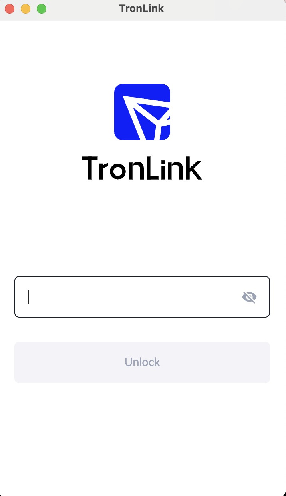
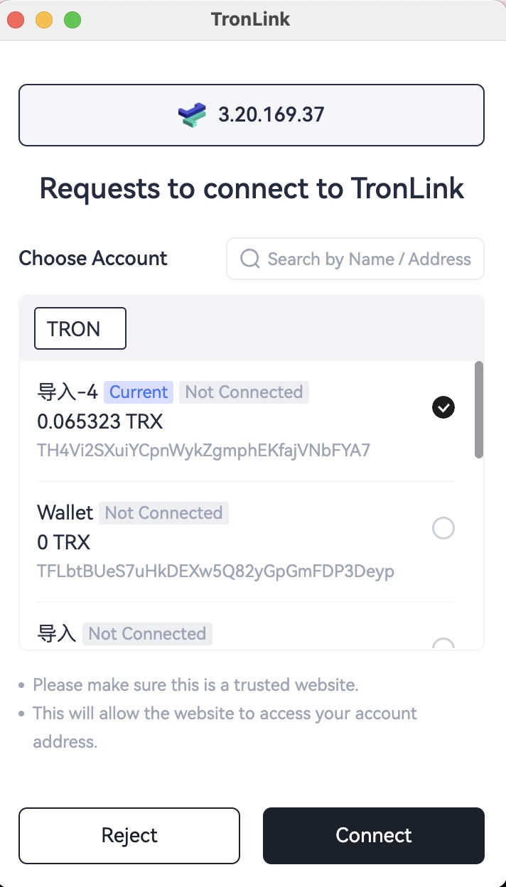
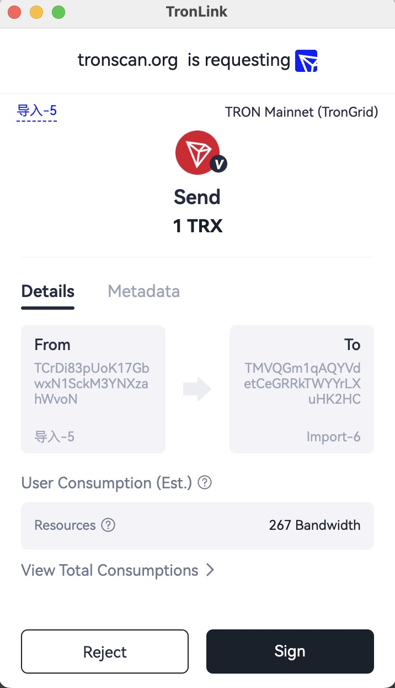
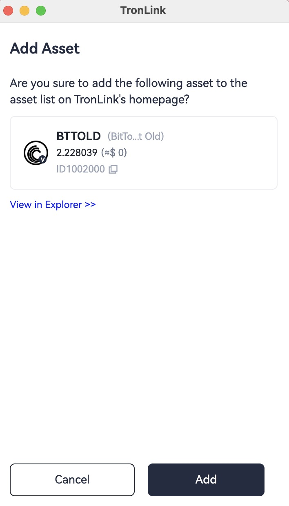
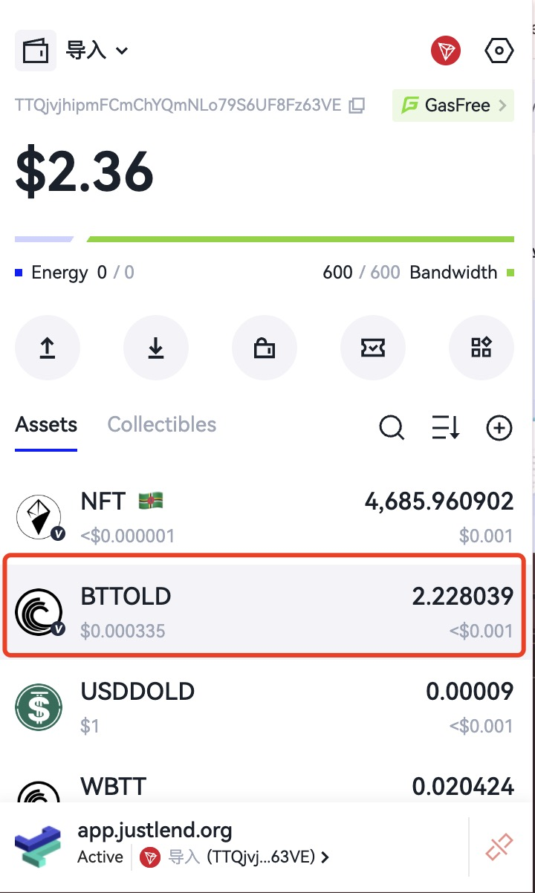
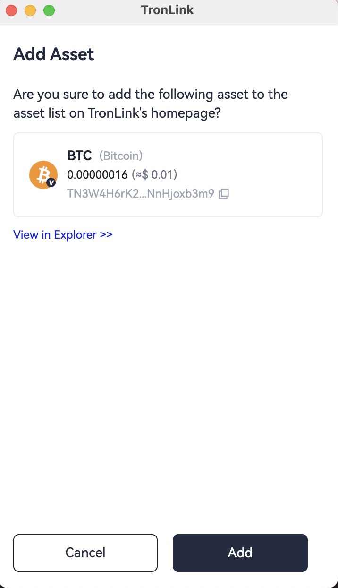
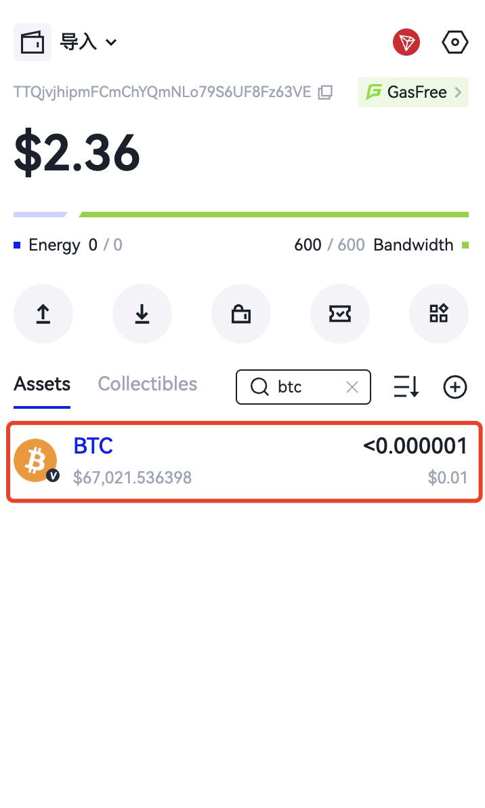
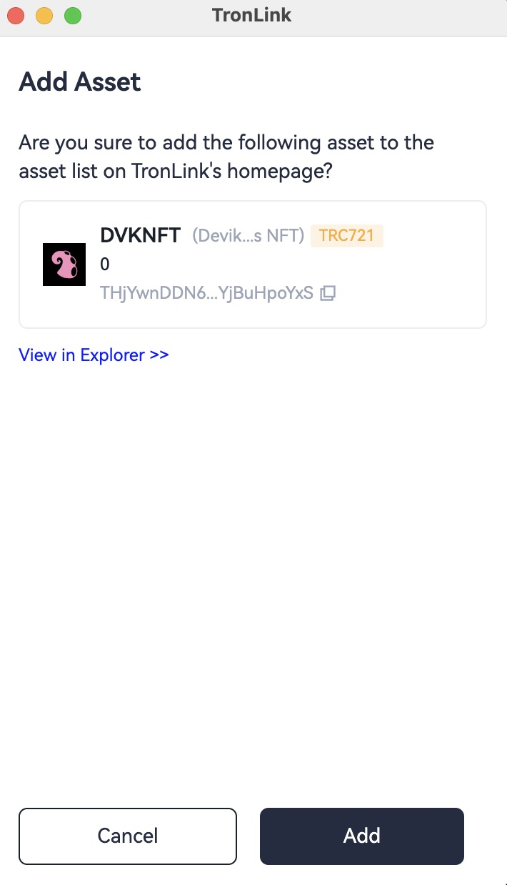
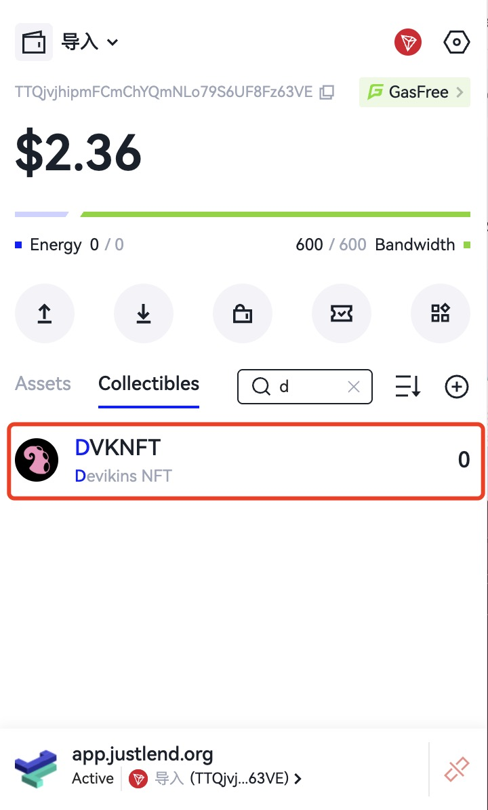
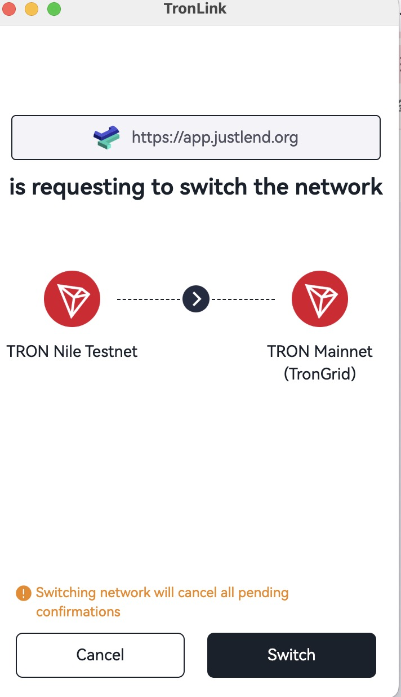

# Proactively Request TronLink Plugin Features

### Connect Website TIP-1102

#### Overview

TronLink can be used to manage wallet private keys.  Before performing operations that require signatures, a DApp must connect to TronLink and obtain user signature authorization through TronLink. This protocol explicitly informs users that the DApp is proactively requesting a TronLink connection and requests their authorization consent.

This method follows the Ethereum **EIP-1102** protocol.

#### Technical Specification

##### Code Example

```javascript
try {
  await tron.request({method: 'eth_requestAccounts'});
} catch (e) {}
```

##### Return Value

If successful, an array is returned with a single element — the currently approved TronLink account. Example:

`['TMVQGm1qAQYVdetCeGRRkTWYYrLXuHK2HC']`

If it fails, an error code and error message will be returned. See the **Error Codes** section below.

##### Error Codes

| Error Code | Name | Description |
| - | - | - |
| 4001 | User rejected request | Triggered when the user clicks “Reject” or closes the popup |
| -32002 | Another process in progress | Another DApp process is ongoing, request cannot execute |
| -32602 | Invalid parameters | Invalid or extra parameters were provided |
| 4200 | Method not supported | This method is not supported |

#### Interaction Flow

After triggering `eth_requestAccounts`, if TronLink is locked, an unlock popup appears:



After unlocking, or if already unlocked, a connection confirmation popup appears:




### Connect Website (Legacy)

This connection method is **deprecated**.  
For future website connection methods, refer to **Connect Website TIP-1102**.

#### Overview

TronLink provides external TRX transfer, contract signing, authorization, and other functions.  
For security reasons, users must first authorize the requesting DApp via **Connect Website** before critical operations are allowed.

Therefore, the DApp must perform the **Connect Website** request first and wait for user approval before initiating operations requiring authorization.

#### Technical Specification

##### Code Example

```typescript
const res = await tronWeb.request(
  {
    method: 'tron_requestAccounts',
    params: {
      websiteIcon: '<WEBSITE ICON URI>',
      websiteName: '<WEBSITE NAME>',
    } as RequestAccountParams,
  }
);
```

##### Parameters

```typescript
interface RequestAccountsParams {
  websiteIcon?: string;
  websiteName?: string;
}
```

- **method:** fixed string `tron_requestAccounts`
- **params:** `RequestAccountParams` type:
  - `websiteIcon`: DApp website icon URI (displayed in connected site list)
  - `websiteName`: DApp website name

##### Return Value

```typescript
interface ReqestAccountsResponse {
  code: 200 | 4000 | 4001,
  message: string
}
```

| Return Code | Description | Message |
| - | - | - |
| None | Wallet locked | Empty string |
| 200 | Site already authorized | The site is already in the whitelist |
| 200 | User approved connection | User allowed the request. |
| 4000 | Duplicate authorization request pending | Authorization requests are being processed, please do not resubmit |
| 4001 | User rejected connection | User rejected the request |

### Get TronLink Provider via TIP-6963

#### Introduction

When multiple wallets exist simultaneously, they may compete to occupy the `window.tron` object. To ensure that a DApp can obtain a specific wallet provider, the TIP-6963 specification is implemented.

#### Technical Specification

##### Code Example

```typescript
interface TIP1193Provider {
  request: (args: RequestArguments) => Promise<unknown>;
  on(event: string, listener: (...args: any[]) => void): this;
  removeListener(event: string, listener: (...args: any[]) => void): this;
  tronWeb: TronWeb;
  [key: `is${string}`]: boolean;
}

/**
 * Represents the assets needed to display a wallet
 */
interface TIP6963ProviderInfo {
  uuid: string;
  name: string;
  icon: string;
  rdns: string;
}

interface TIP6963ProviderDetail {
  info: TIP6963ProviderInfo;
  provider: TIP1193Provider;
}

// Announce Event dispatched by a Wallet
interface TIP6963AnnounceProviderEvent extends CustomEvent {
  type: "TIP6963:announceProvider";
  detail: TIP6963ProviderDetail;
}

// The DApp listens to announced providers
window.addEventListener(
  "TIP6963:announceProvider",
  (event: TIP6963AnnounceProviderEvent) => {
    
    // Confirm if it is a Tronlink UUID
    if (event.detail.info.rdns !== 'org.tronlink.www' || event.detail.info.name !== 'TronLink') {
      console.error('it is NOT TronLink provider');
      return;
    }

    // event.detail.provider === window.tron
    const tronProvider = event.detail.provider;

    tronProvider.on('accountsChanged', (accountArray) => {
      console.log('tip-6963 accountsChanged', accountArray);
    })
  }
);

// The DApp dispatches a request event which will be heard by 
// Wallets' code that had run earlier
window.dispatchEvent(new Event("TIP6963:requestProvider"));
```
After implementing the above code, the DApp can precisely obtain the provider supplied by TronLink.TronLink’s rdns is `org.tronlink.www`, and its name is `TronLink`.

### Normal Transfer

#### Overview

A DApp needs the user to initiate a TRX transfer.

**Prerequisite:**  
The developer must complete the **Connect Website** request and the user must approve it.

A transfer on the TRON network requires three steps:

1. Construct the transaction  
2. Sign the transaction  
3. Broadcast the signed transaction  

TronLink handles **step 2 (signing)**, while steps 1 and 3 must be completed using TronWeb.

#### Technical Specification

##### Code Example

```typescript
if (window.tronLink.ready) {
  const tronweb = tronLink.tronWeb;
  const fromAddress = tronweb.defaultAddress.base58;
  const toAddress = "TDvSsdrNM5eeXNL3czpa6AxLDHZA9nwe9K";
  const tx = await tronweb.transactionBuilder.sendTrx(toAddress, 10, fromAddress);

  try {
    const signedTx = await tronweb.trx.sign(tx);
    await tronweb.trx.sendRawTransaction(signedTx);
  } catch (e) {}
}
```

When executing `await tronweb.trx.sign(tx);`, TronLink displays a confirmation popup. 



Reject → exception thrown.  
Sign → signed transaction returned for broadcasting.


### Multi-Signature Transfer

#### Overview

Refer to **Normal Transfer** above.

#### Technical Specification

##### Code Example

```typescript
if (window.tronLink.ready) {
  const tronweb = tronLink.tronWeb;
  const toAddress = "TDvSsdrNM5eeXNL3czpa6AxLDHZA9nwe9K";
  const activePermissionId = 2;

  const tx = await tronweb.transactionBuilder.sendTrx(
      toAddress, 10,
      { permissionId: activePermissionId}
  );

  try {
    const signedTx = await tronweb.trx.multiSign(tx, undefined, activePermissionId);
    await tronweb.trx.sendRawTransaction(signedTx);
  } catch (e) {}
}
```

Rejecting triggers an exception; signing returns the signed transaction for broadcasting.


### Message Signing

#### Overview

A DApp may require users to sign a hex message.  
The signed message is then sent to the backend for verification to authenticate user login.

#### Prerequisite

The developer must complete **Connect Website** authorization.

#### Technical Specification

##### Code Example

```typescript
if (window.tronLink.ready) {
  const tronweb = tronLink.tronWeb;

  try {
    const message = "0x01EF";
    const signedString = await tronweb.trx.signMessageV2(message);
  } catch (e) {}
}
```

##### Parameter

`tronLink.tronweb.trx.signMessageV2` accepts a hexadecimal string representing the message to sign.

##### Return Value

If signed successfully:

```
0xaa302ca153b10dff25b5f00a7e2f603c5916b8f6d78cdaf2122e24cab56ad39a79f60ff3916dde9761baaadea439b567475dde183ee3f8530b4cc76082b29c341c
```

If an error occurs:

```typescript
Uncaught (in promise) Invalid transaction provided
```

#### Interaction Flow

When executing signing, TronLink shows a confirmation popup with the hex message.  


Reject → exception.  
Sign → signed message returned.


### Add Asset

#### Overview

A DApp can provide a button allowing users to directly add a token to their TronLink asset list.

#### Technical Specification

##### Code Example

```typescript
const res = await tronWeb.request(
  {
    method: 'wallet_watchAsset',
    params: {
      type: 'TRC20',
      options: {
          address: 'TR7NHqjeKQxGTCi8q8ZY4pL8otSzgjLj6t'
      }
    },
  }
);
```

##### Parameters

```typescript
interface WatchAssetParams {
  type: 'trc10' | 'trc20' | 'trc721';
  options: {
    address: string;
    symbol?: string;
    decimals?: number;
    image?: string;
  }
}
```

- **method:** `wallet_watchAsset`
- **type:** `trc10`, `trc20`, `trc721`
- **address:** token contract address or token ID (required)

##### Return Value

No return value.

#### Interaction Flow

##### Add TRC10

```typescript
tronweb.request({
  method: 'wallet_watchAsset',
  params: {
    type: 'trc10',
    options: { address: '1002000' },
  },
});
```
When the code executes, TronLink will display an add-asset popup where the user can confirm adding the TRC10 asset or cancel the request.



Click the “Add” button and the asset will be added to the asset list, as shown below.



##### Add TRC20

```typescript
tronweb.request({
  method: 'wallet_watchAsset',
  params: {
    type: 'trc20',
    options: { address: 'TN3W4H6rK2ce4vX9YnFQHwKENnHjoxb3m9' },
  },
});
```

When the code executes, TronLink will display an add-asset popup where the user can confirm adding the TRC20 asset or cancel the request.



Click the “Add” button and the asset will be added to the asset list, as shown below.



##### Add TRC721

```typescript
tronweb.request({
  method: 'wallet_watchAsset',
  params: {
    type: 'trc721',
    options: { address: 'TVtaUnsgKXhTfqSFRnHCsSXzPiXmm53nZt' },
  },
});
```

When the code executes, TronLink will display an add-asset popup where the user can confirm adding the TRC721 asset or cancel the request.



Click the “Add” button and the asset will be added to the asset list, as shown below.




### Switch Network TIP-3326

`Switch Network` is **not supported in 4.0-beta1**, supported starting **4.0-beta2**.

#### Overview

Most DApps operate on specific chains.  
This protocol allows a DApp to request TronLink to switch chains, with user confirmation.

After approval, the DApp can operate normally on that chain.

This protocol follows **EIP-3326**.

#### Technical Specification

##### Code Example

```javascript
try {
  await tronLink.request({
    method: 'wallet_switchEthereumChain',
    params: [{chainId: '0x2b6653dc'}]
  });
} catch (e) {}
```

##### Parameters

```typescript
interface SwitchTronChainParameter {
  chainId: string;
}
```

Supported chain IDs:

- Mainnet: `0x2b6653dc`
- Shasta Testnet: `0x94a9059e`
- Nile Testnet: `0xcd8690dc`

##### Return Value

- Success → `null`
- Failure → error code + message

##### Error Codes

| Error Code | Name | Description |
| - | - | - |
| 4001 | User rejected request |
| 4902 | Invalid chainId |
| -32002 | Another process in progress |
| -32602 | Invalid parameters |
| 4200 | Method not supported |

#### Interaction Flow

Triggering the request shows an unlock popup if TronLink is locked, then a network switch confirmation popup after unlocking.



