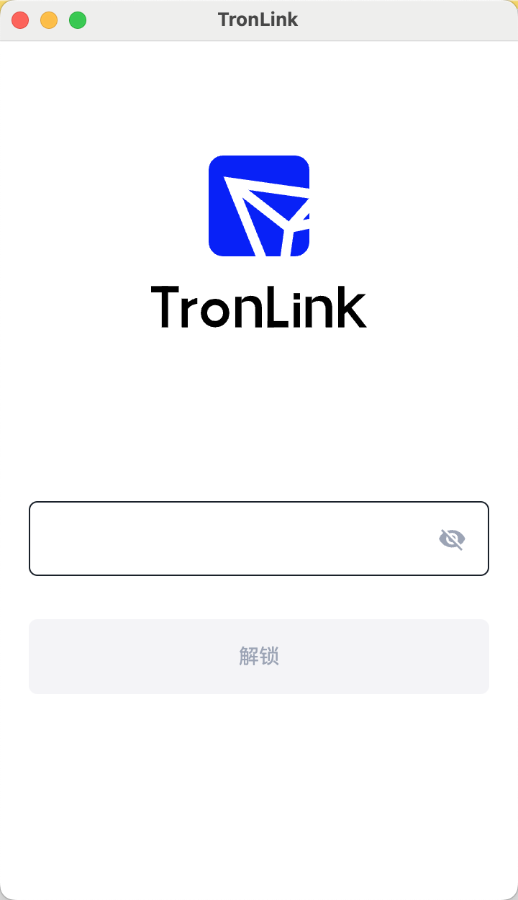
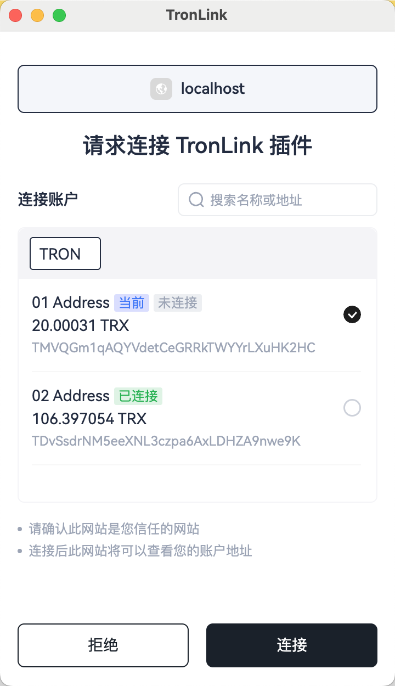
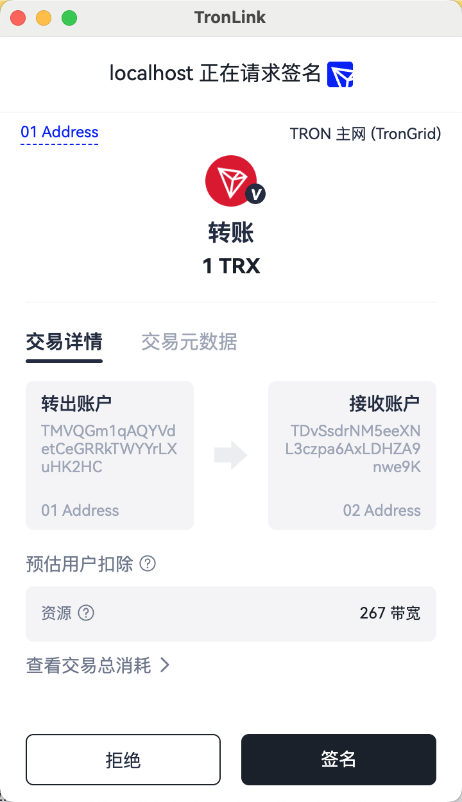
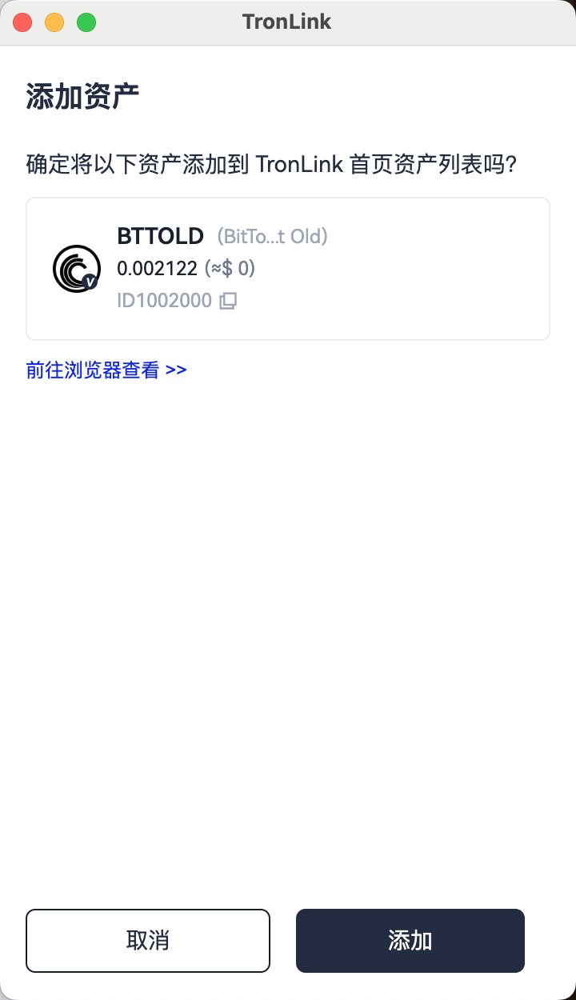
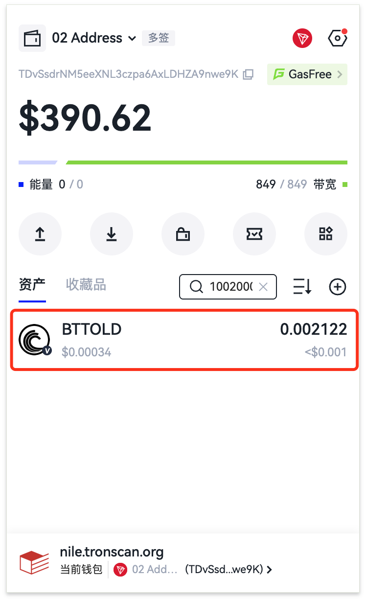
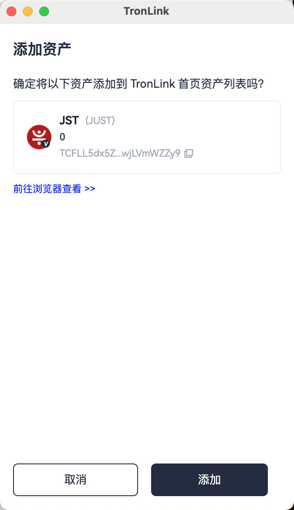
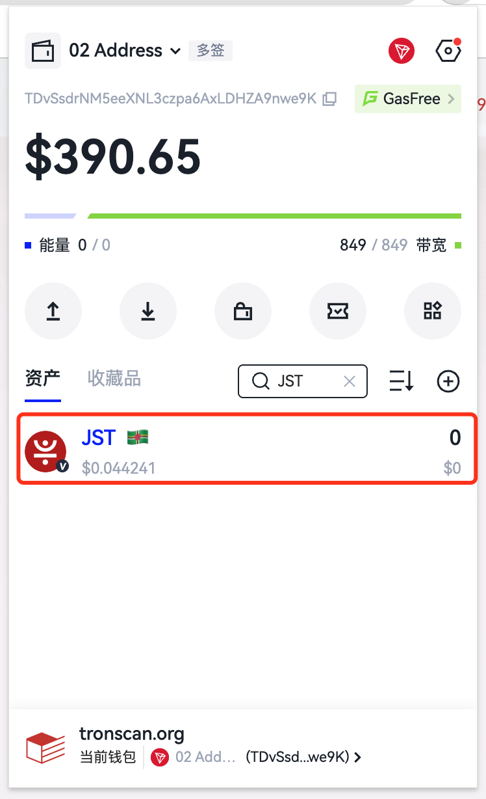
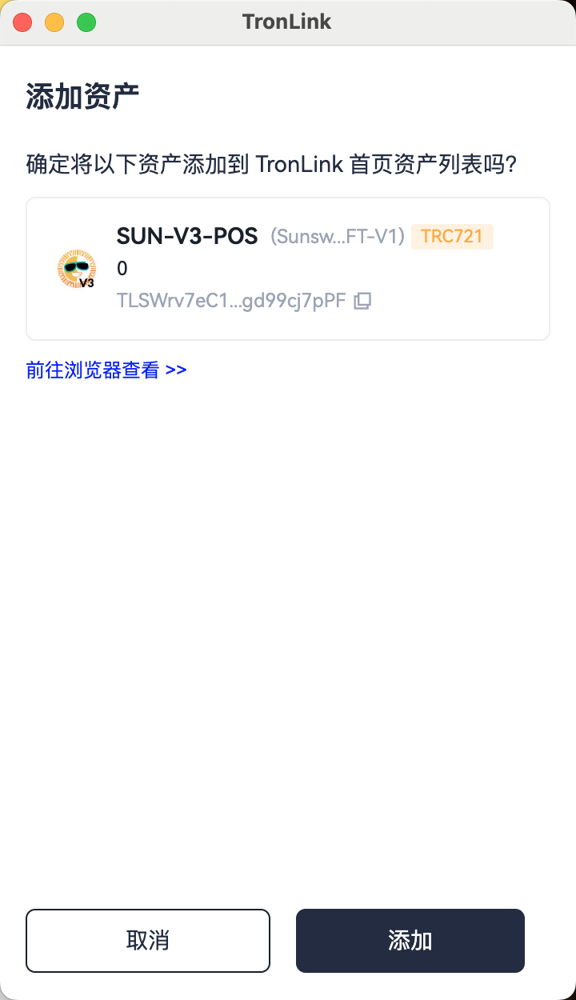
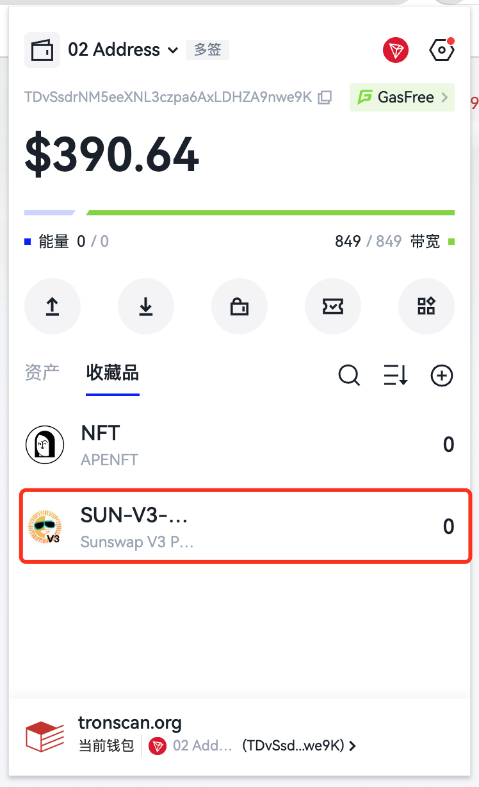
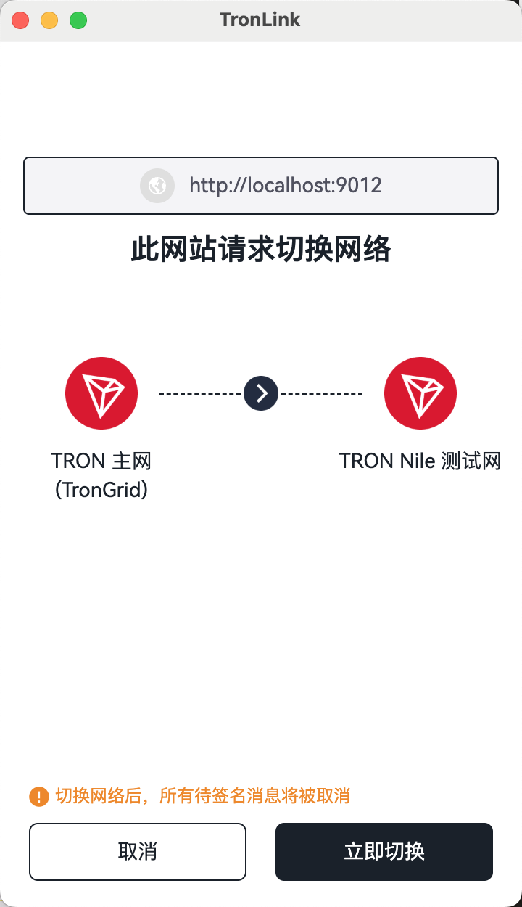

# 主动请求TronLink插件功能

### 连接网站 TIP-1102

#### 简介
TronLink 可用于管理钱包私钥，DApp 在进行一些需签名的操作前，需要连接 TronLink，并通过 TronLink 获取用户签名授权。此协议在于显式地告知用户 DApp 主动连接 TronLink 的行为，并获取用户的授权同意。
此方法遵循以太坊 EIP-1102 协议。

#### 技术规范
##### 代码示例
```javascript
try {
  await window.tron.request({method: 'eth_requestAccounts'});
} catch (e) {}
```
##### 返回值

如果成功，返回一个数组，数组只有一个元素，为同意连接的当前 TronLink 账户。如：
`['TMVQGm1qAQYVdetCeGRRkTWYYrLXuHK2HC']`。

如果失败，则会返回错误码及报错信息。详见“错误码”部分。

##### 错误码
|  错误码   | 名称  | 描述 |
|  ----  | ----  | ---- |
| 4001  | 用户拒绝请求 | 用户通过点击“拒绝”按钮，或关闭弹窗，都会触发该错误码 |
| -32002  | 处于其他流程中 | 当前 DApp 存在其他流程，无法执行当前请求 |
| -32602  | 参数不合规 | 传入的参数不合规，或者传入了额外的参数 |
| 4200  | 不支持此方法 | 不支持此方法 |

#### 交互流程
触发 `eth_requestAccounts` 之后，如果 TronLink 处于锁屏状态，会弹出锁屏弹窗：



解锁后，或者 TronLink 已经提前解锁，会打开连接确认的弹窗：



> **旧版用法（不推荐）：** [兼容用法：tron_requestAccounts](#tron_requestaccounts)


### 获取TronLink的provider TIP-6963

#### 简介
当多个钱包同时存在，会出现对 `window.tron` 对象的抢占行为。为了保证 DApp 可以获取到特定钱包的 provider，所以实现 TIP-6963 规范。
#### 技术规范
##### 代码示例
```typescript
interface TIP1193Provider {
  request: (args: RequestArguments) => Promise<unknown>;
  on(event: string, listener: (...args: any[]) => void): this;
  removeListener(event: string, listener: (...args: any[]) => void): this;
  tronWeb: TronWeb;
  [key: `is${string}`]: boolean;
}

/**
 * Represents the assets needed to display a wallet
 */
interface TIP6963ProviderInfo {
  uuid: string;
  name: string;
  icon: string;
  rdns: string;
}

interface TIP6963ProviderDetail {
  info: TIP6963ProviderInfo;
  provider: TIP1193Provider;
}

// Announce Event dispatched by a Wallet
interface TIP6963AnnounceProviderEvent extends CustomEvent {
  type: "TIP6963:announceProvider";
  detail: TIP6963ProviderDetail;
}

// The DApp listens to announced providers
window.addEventListener(
  "TIP6963:announceProvider",
  (event: TIP6963AnnounceProviderEvent) => {
    
    // Confirm if it is a Tronlink UUID
    if (event.detail.info.rdns !== 'org.tronlink.www' || event.detail.info.name !== 'TronLink') {
      console.error('it is NOT TronLink provider');
      return;
    }

    // event.detail.provider === window.tron
    const tronProvider = event.detail.provider;

    tronProvider.on('accountsChanged', (accountArray) => {
      console.log('tip-6963 accountsChanged', accountArray);
    })
  }
);

// The DApp dispatches a request event which will be heard by 
// Wallets' code that had run earlier
window.dispatchEvent(new Event("TIP6963:requestProvider"));
```
DApp 按照上述代码实现后，可以精准获取到 TronLink 提供的 provider。
TronLink 的 rdns 是 `org.tronlink.www`，name 是 `TronLink`。

### 普通转账 sendTrx

> **前提条件：** 已通过 `eth_requestAccounts` 完成 DApp 连接授权（参见上方 [连接网站 TIP-1102](#tip-1102)）。

#### 简介
DApp 需要用户发起一笔 TRX 转账。

波场网络上发起转账需要 3 个步骤：

1. 构造转账交易
2. 对交易进行签名
3. 对签名后的交易进行广播

在这里，TronLink 介入的是第 2 步签名的部分，1、3 两步需要开发者使用 tronWeb 完成。
#### 技术规范
##### 代码示例
```typescript
const tronweb = window.tron.tronWeb;
const fromAddress = tronweb.defaultAddress.base58;
const toAddress = "TDvSsdrNM5eeXNL3czpa6AxLDHZA9nwe9K";
const tx = await tronweb.transactionBuilder.sendTrx(toAddress, 10, fromAddress); // 步骤1
try {
  const signedTx = await tronweb.trx.sign(tx); // 步骤2
  await tronweb.trx.sendRawTransaction(signedTx); // 步骤3
} catch (e) {}
```

当代码执行到 `await tronweb.trx.sign(tx);` 时，TronLink 钱包会提示弹窗，需要用户进行确认，如下图：



如果用户在弹窗中选择【拒绝】，则会抛出异常，开发者可捕获此异常进行业务处理。

如果用户在弹窗中选择【签名】，DApp 可以拿到签名后的交易，继续进行广播。

> **旧版用法（不推荐）：** [兼容用法：sendTrx（window.tronLink）](#sendtrxwindowtronlink)


### 多签转账 multiSign

> **前提条件：** 已通过 `eth_requestAccounts` 完成 DApp 连接授权（参见上方 [连接网站 TIP-1102](#tip-1102)）。

#### 简介
此处可参考 [普通转账 sendTrx](#sendtrx)。

#### 技术规范
##### 代码示例
```typescript
const tronweb = window.tron.tronWeb;
const toAddress = "TDvSsdrNM5eeXNL3czpa6AxLDHZA9nwe9K";
const activePermissionId = 2;
const tx = await tronweb.transactionBuilder.sendTrx(
    toAddress, 10, 
    { permissionId: activePermissionId}
); // 步骤1
try {
  const signedTx = await tronweb.trx.multiSign(tx, undefined, activePermissionId); // 步骤2
  await tronweb.trx.sendRawTransaction(signedTx); // 步骤3
} catch (e) {}
```

如果用户在弹窗中选择【拒绝】，则会抛出异常，开发者可捕获此异常进行业务处理。

如果用户在弹窗中选择【签名】，DApp 可以拿到签名后的交易，继续进行广播。

> **旧版用法（不推荐）：** [兼容用法：multiSign（window.tronLink）](#multisignwindowtronlink)


### 消息签名 signMessageV2

> **前提条件：** 已通过 `eth_requestAccounts` 完成 DApp 连接授权（参见上方 [连接网站 TIP-1102](#tip-1102)）。

#### 简介
DApp 需要用户对一个 hex 消息签名，签名后消息转发给后端进行验签，以此判断用户合法登录。

#### 技术规范
##### 代码示例
```typescript
const tronweb = window.tron.tronWeb;
try {
  const message = "0x01EF"; // any hex string
  const signedString = await tronweb.trx.signMessageV2(message);
} catch (e) {}
```
##### 参数
`window.tron.tronWeb.trx.signMessageV2` 接收一个十六进制的字符串作为参数，该字符串表示当前待签名的内容。

##### 返回值
如果用户在弹窗中选择签名，DApp 可以得到签名后的十六进制字符串，比如：
```
0xaa302ca153b10dff25b5f00a7e2f603c5916b8f6d78cdaf2122e24cab56ad39a79f60ff3916dde9761baaadea439b567475dde183ee3f8530b4cc76082b29c341c
```
如果报错，则会返回如下信息：
```typescript
Uncaught (in promise) Invalid transaction provided
```


#### 交互流程

当代码执行到 `await tronweb.trx.signMessageV2(message);` 时，TronLink 钱包会提示弹窗，需要用户进行确认，如下图，其中消息内容会以 hex 的方式展示：


如果用户在弹窗中选择【拒绝】，则会抛出异常，开发者可捕获此异常进行业务处理。

> **旧版用法（不推荐）：** [兼容用法：signMessageV2（window.tronLink）](#signmessagev2windowtronlink)


### 添加资产 wallet_watchAsset

> **前提条件：** 已通过 `eth_requestAccounts` 完成 DApp 连接授权（参见上方 [连接网站 TIP-1102](#tip-1102)）。

#### 简介
DApp 提供按钮给用户，直接将指定的 Token 添加到用户插件的资产展示列表中。


#### 技术规范
##### 代码示例
```typescript
const res = await window.tron.request({
  method: 'wallet_watchAsset',
  params: {
    type: 'trc20',
    options: {
        address: 'TR7NHqjeKQxGTCi8q8ZY4pL8otSzgjLj6t'
    }
  } as WatchAssetParams,
});
```

##### 参数
```typescript
interface WatchAssetParams {
  type: 'trc10' | 'trc20' | 'trc721';
  options: {
    address: string;
    symbol?: string;
    decimals?: number;
    image?: string;
  }
}
```
* method: `wallet_watchAsset`，固定字符串
* params: `WatchAssetParams`，具体参数如下
  * type: 目前只支持 `trc10` / `trc20` / `trc721` 三种
  * options:
    * address: token 的合约地址 或者 token id，必传
    * symbol: 占位（目前未使用），可选
    * decimals: 占位（目前未使用），可选
    * image: 占位（目前未使用），可选


##### 返回值
此方法没有返回值。

#### 交互流程
##### 添加 TRC10 资产
```typescript
await window.tron.request({
  method: 'wallet_watchAsset',
  params: {
    type: 'trc10',
    options: {
      address: '1002000'
    },
  },
});
```

代码执行时，TronLink 会弹出添加窗口，用户点击确定添加 TRC10 资产，或者取消添加。



点击”添加”按钮，资产被添加到资产列表，如下图所示。




##### 添加 TRC20 资产
```typescript
await window.tron.request({
  method: 'wallet_watchAsset',
  params: {
    type: 'trc20',
    options: {
      address: 'TN3W4H6rK2ce4vX9YnFQHwKENnHjoxb3m9'
    },
  },
});
```

代码执行时，TronLink 会弹出添加窗口，用户点击确定添加 TRC20 资产，或者取消添加。



点击”添加”按钮，资产被添加到资产列表，如下图所示。



##### 添加 TRC721 资产
```typescript
await window.tron.request({
  method: 'wallet_watchAsset',
  params: {
    type: 'trc721',
    options: {
      address: 'TVtaUnsgKXhTfqSFRnHCsSXzPiXmm53nZt'
    },
  },
});
```

代码执行时，TronLink 会弹出添加窗口，用户点击确定添加 TRC721 资产，或者取消添加。



点击”添加”按钮，资产被添加到资产列表，如下图所示。



> **旧版用法（不推荐）：** [兼容用法：wallet_watchAsset（window.tronLink）](#wallet_watchassetwindowtronlink)


### 切换网络 TIP-3326

#### 简介
大部分 DApp 都会在特定的链上提供服务。DApp 可以通过调用本协议，告诉 TronLink 期望使用的链，TronLink 会弹出弹窗告知用户即将切换的链，用户可以选择是否同意切换。
在用户同意切换后，DApp 可以基于目标链，提供正常的 DApp 服务。
本协议遵循以太坊 EIP-3326 协议。

#### 技术规范
##### 代码示例
```javascript
try {
  await window.tron.request({
    method: 'wallet_switchEthereumChain',
    params: [{chainId: '0x2b6653dc'}]
  });
} catch (e) {}
```
##### 参数
params 接受一个只有单一元素的数组，单一元素为 `SwitchTronChainParameter` 类型：
```typescript
interface SwitchTronChainParameter {
  chainId: string;
}
```
- 目前只支持如下 chainId：
  - mainnet（主网）：`0x2b6653dc`
  - shasta（shasta 测试网）：`0x94a9059e`
  - nile（nile 测试网）：`0xcd8690dc`
- chainId 的值大小写敏感。


##### 返回值
如果成功，返回 null。
如果失败，则会返回错误码及报错信息。详见“错误码”部分。

##### 错误码
|  错误码   | 名称  | 描述 |
|  ----  | ----  | ---- |
| 4001  | 用户拒绝请求 | 用户通过点击“拒绝”按钮，或关闭弹窗，都会触发该错误码 |
| 4902  | 不合法 chainId | 目前只支持部分 chainId，详见“目前支持的 chainId”部分 |
| -32002  | 处于其他流程中 | 当前 DApp 存在其他流程，无法执行当前请求 |
| -32602  | 参数不合规 | 传入的参数不合规，或者传入了额外的参数 |
| 4200  | 不支持此方法 | 不支持此方法 |


#### 交互流程
触发 `wallet_switchEthereumChain` 之后，如果 TronLink 处于锁屏状态，会弹出锁屏弹窗：


解锁后，或者 TronLink 已经提前解锁，会打开连接确认的弹窗：



> **旧版用法（不推荐）：** [兼容用法：wallet_switchEthereumChain（tronLink.request）](#wallet_switchethereumchaintronlinkrequest)


---

## 旧版用法（不推荐）

下列接口作为兼容别名保留，新接入请使用上方推荐用法。`window.tronLink` 与 `window.tron` 在功能上等价，但前者将逐步不再维护。

### 兼容用法：tron_requestAccounts

#### 简介
TronLink 提供外部发起 TRX 转账、合约签名、授权等功能。基于安全的考虑，需要用户在关键操作前先对发起请求的 DApp 进行【连接网站】授权，在授权成功后才允许操作。
所以 DApp 要先进行【连接网站】操作，等待用户允许后，方能发起需要授权的请求。

#### 技术规范
##### 代码示例
```typescript
const res = await tronWeb.request(
  {
    method: 'tron_requestAccounts',
    params: {
      websiteIcon: '<WEBSITE ICON URI>',
      websiteName: '<WEBSITE NAME>',
    } as RequestAccountParams,
  }
);
```

##### 参数
```typescript
interface RequestAccountsParams {
  websiteIcon?: string;
  websiteName?: string;
}
```
* method: `tron_requestAccounts` 固定的字符串
* params: `RequestAccountParams` 类型，具体参数如下
    * websiteIcon: DApp 网站的 Icon 的 URI，具体会展示在用户已连接网站列表中
    * websiteName: DApp 网站名称


##### 返回值
类型说明：
```typescript
interface ReqestAccountsResponse {
  code: 200 | 4000 | 4001,
  message: string
}
```

|  返回码   | 描述  | 返回消息 |
|  ----  | ----  | ---- |
| 无  | 钱包处于锁定状态 | 空字符串 |
| 200  | 网站此前已被用户允许连接 | The site is already in the whitelist |
| 200  | 用户同意连接 | User allowed the request. |
| 4000  | 当前请求前已经有同一个 DApp 发起了连接网站请求，并且弹窗仍未关闭 | Authorization requests are being processed, please do not resubmit |
| 4001  | 用户拒绝连接 | User rejected the request |


### 兼容用法：sendTrx（window.tronLink）

```typescript
if (window.tronLink.ready) {
  const tronweb = tronLink.tronWeb;
  const fromAddress = tronweb.defaultAddress.base58;
  const toAddress = "TDvSsdrNM5eeXNL3czpa6AxLDHZA9nwe9K";
  const tx = await tronweb.transactionBuilder.sendTrx(toAddress, 10, fromAddress); // 步骤1
  try {
    const signedTx = await tronweb.trx.sign(tx); // 步骤2
    await tronweb.trx.sendRawTransaction(signedTx); // 步骤3
  } catch (e) {}
}
```


### 兼容用法：multiSign（window.tronLink）

```typescript
if (window.tronLink.ready) {
  const tronweb = tronLink.tronWeb;
  const toAddress = "TDvSsdrNM5eeXNL3czpa6AxLDHZA9nwe9K";
  const activePermissionId = 2;
  const tx = await tronweb.transactionBuilder.sendTrx(
      toAddress, 10, 
      { permissionId: activePermissionId}
  ); // 步骤1
  try {
    const signedTx = await tronweb.trx.multiSign(tx, undefined, activePermissionId); // 步骤2
    await tronweb.trx.sendRawTransaction(signedTx); // 步骤3
  } catch (e) {}
}
```


### 兼容用法：signMessageV2（window.tronLink）

```typescript
if (window.tronLink.ready) {
  const tronweb = tronLink.tronWeb;
  try {
    const message = "0x01EF"; // any hex string
    const signedString = await tronweb.trx.signMessageV2(message);
  } catch (e) {}
}
```


### 兼容用法：wallet_watchAsset（window.tronLink）

```typescript
// 添加 TRC10
if (window.tronLink.ready) {
  const tronweb = tronLink.tronWeb;
  try {
    tronweb.request({
      method: 'wallet_watchAsset',
      params: {
        type: 'trc10',
        options: { address: '1002000' },
      },
    });
  } catch (e) {}
}

// 添加 TRC20
if (window.tronLink.ready) {
  const tronweb = tronLink.tronWeb;
  try {
    tronweb.request({
      method: 'wallet_watchAsset',
      params: {
        type: 'trc20',
        options: { address: 'TN3W4H6rK2ce4vX9YnFQHwKENnHjoxb3m9' },
      },
    });
  } catch (e) {}
}

// 添加 TRC721
if (window.tronLink.ready) {
  const tronweb = tronLink.tronWeb;
  try {
    tronweb.request({
      method: 'wallet_watchAsset',
      params: {
        type: 'trc721',
        options: { address: 'TVtaUnsgKXhTfqSFRnHCsSXzPiXmm53nZt' },
      },
    });
  } catch (e) {}
}
```


### 兼容用法：wallet_switchEthereumChain（tronLink.request）

```javascript
try {
  await tronLink.request({
    method: 'wallet_switchEthereumChain',
    params: [{chainId: '0x2b6653dc'}]
  });
} catch (e) {}
```
