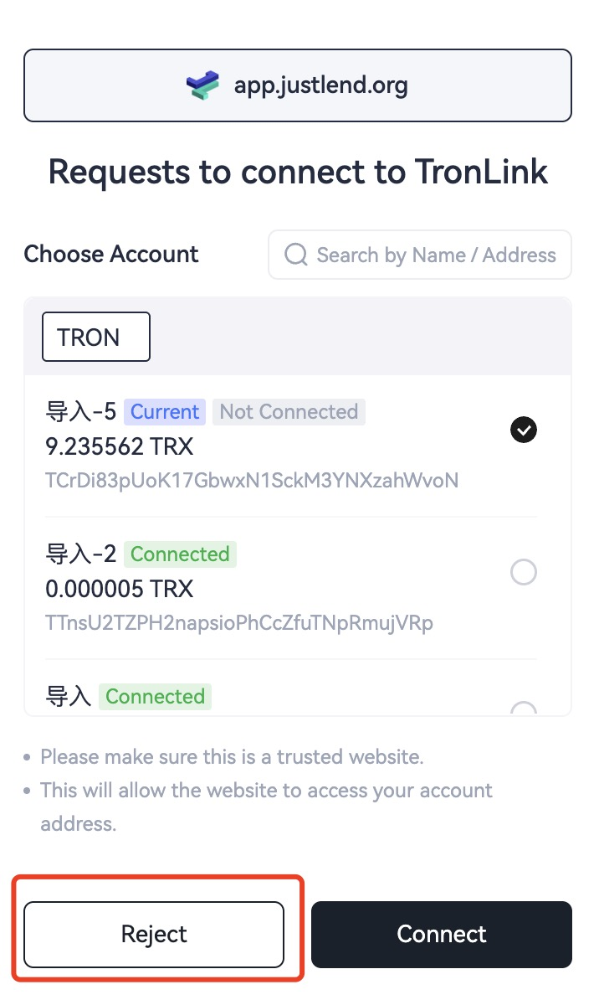
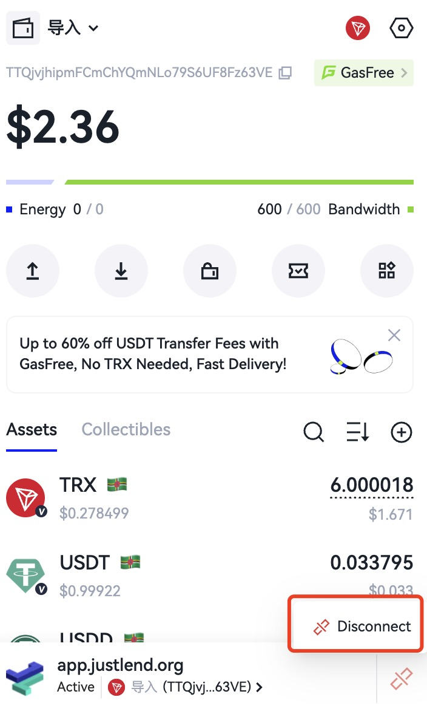
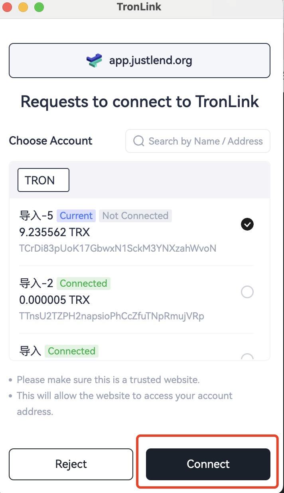
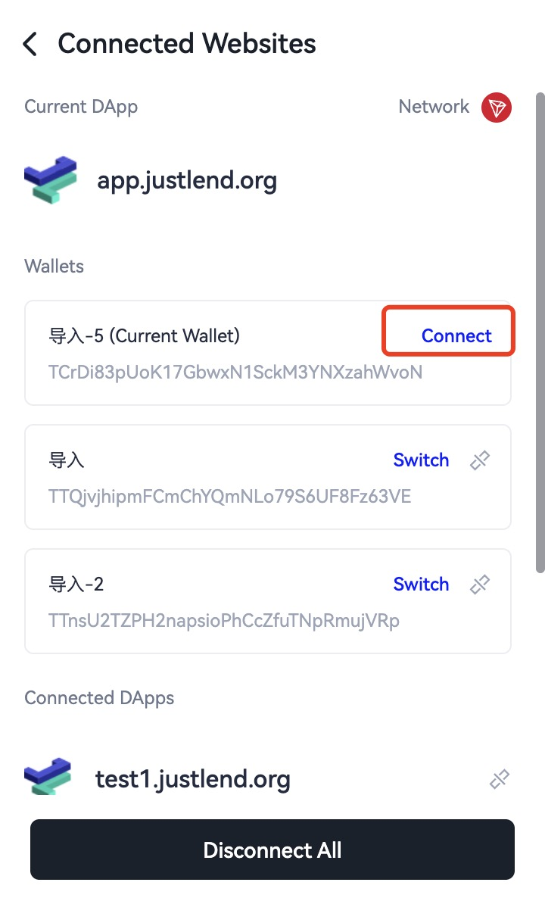

# Passively Receiving Messages from the TronLink Plugin

Messages are sent using `window.postMessage`.  
The content received by a DApp is a `MessageEvent`.  
Refer to the [MessageEvent MDN documentation](https://developer.mozilla.org/en-US/docs/Web/API/MessageEvent).


### Account Change Message

Message identifier: `accountsChanged`

#### Overview

This message is generated in the following situations:

1. User logs in  
2. User switches account  
3. User locks the wallet  
4. Wallet auto-locks due to timeout  

#### Technical Specification

##### Code Example

```typescript
window.tron.on('accountsChanged', (accountArray) => {
  // handler logic
  console.log('got accountsChanged event', accountArray)
})
```

##### Return Value

```typescript
['your_current_account_address']
```

###### Return Value Examples

1. When the user logs in:

```json
['TZ5XixnRyraxJJy996Q1sip85PHWuj4793']
```

(Current account)

2. When the user switches accounts:

```json
['TRKb2nAnCBfwxnLxgoKJro6VbyA6QmsuXq']
```

(Newly selected account)

3. When the wallet is locked or auto-locked:

```json
[]
```


### Network Change Message

Message identifier: `chainChanged`

#### Overview

Developers can listen to this message to detect network changes.

This message is generated when:

1. The user changes the network.

#### Technical Specification

##### Code Example

```typescript
window.tron.on('chainChanged', ({chainId}) => {
  // handler logic
  console.log('got chainChanged event', chainId)
})
```

##### Return Value

```json
{
  chainId: string;
}
```

Currently supported `chainId` values:

- Mainnet: `0x2b6653dc`
- Shasta Testnet: `0x94a9059e`
- Nile Testnet: `0xcd8690dc`

**Note:** Chain IDs are case-sensitive.

### TronLink Service Availability Message

Message identifier: `connect`

#### Overview

If TronLink and the `window.tron` object are available, this event will always be emitted.

This includes:

- After the provider initializes and connects to a chain.  
- After a `disconnect` event when the provider reconnects to a chain.  

#### Technical Specification

##### Code Example

```typescript
window.tron.on('connect', ({chainId}) => {
  // handler logic
  console.log('got accountsChanged event', chainId)
})
```


### Website Disconnect Message

Message identifier: `disconnect`

#### Overview

If the provider disconnects from all chains, it must emit a `disconnect` event and return a `ProviderRpcError` object.

#### Technical Specification

##### Code Example

```typescript
tron.on('disconnect', (providerRpcError: ProviderRpcError) => {
  console.error(connectInfo); // { code: 4900, message: 'Disconnected' }
})
```

---

### Legacy Compatibility Messages

The following four messages are retained for compatibility with version 3.x and will be deprecated in future versions:

1. User rejected connection → `rejectWeb`  
2. User disconnected the website → `disconnectWeb`  
3. User confirmed connection → `acceptWeb`  
4. User proactively connected the website → `connectWeb`  

### User Rejected Connection Message

Message identifier: `rejectWeb`

Generated when:

1. A DApp requests connection and the user rejects it in the popup.

{ width="350" }

Developers can listen for this message:

```typescript
window.addEventListener('message', function (e) {
  if (e.data.message && e.data.message.action == "rejectWeb") {
      // handler logic
      console.log('got rejectWeb event', e.data)
  }
})
```


### User Disconnected Website Message

Message identifier: `disconnectWeb`

Generated when:

1. The user manually disconnects the website.

{ width="350" }

Developers can listen for this message:

```typescript
window.addEventListener('message', function (e) {
  if (e.data.message && e.data.message.action == "disconnectWeb") {
      // handler logic
      console.log('got disconnectWeb event', e.data)
  }
})
```

### User Confirmed Connection Message

Message identifier: `acceptWeb`

Generated when:

1. The user confirms the connection request.

{ width="350" }

Developers can listen for this message:

```typescript
window.addEventListener('message', function (e) {
  if (e.data.message && e.data.message.action == "acceptWeb") {
      // handler logic
      console.log('got acceptWeb event', e.data)
  }
})
```

### User Proactively Connected Website Message

Message identifier: `connectWeb`

Generated when:

1. The user proactively connects to the website.

{ width="350" }

Developers can listen for this message:

```typescript
window.addEventListener('message', function (e) {
  if (e.data.message && e.data.message.action == "connectWeb") {
      // handler logic
      console.log('got connectWeb event', e.data)
  }
})
```
