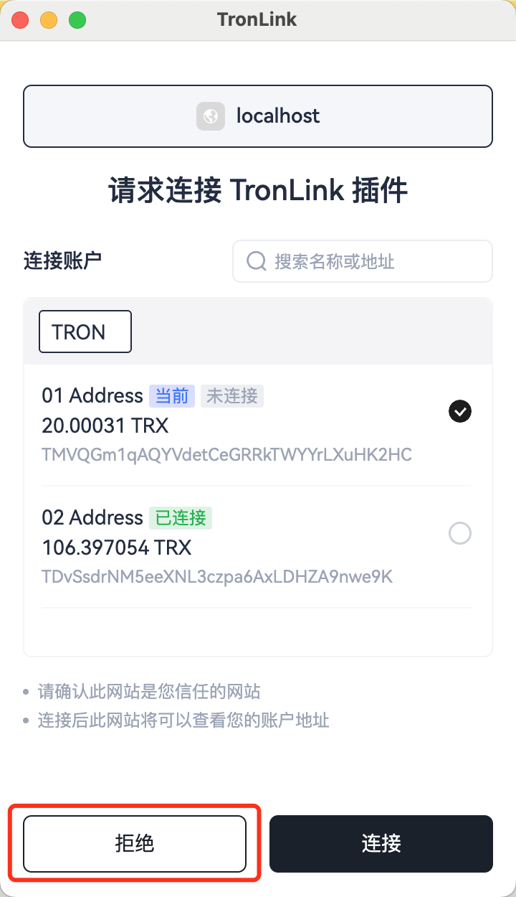
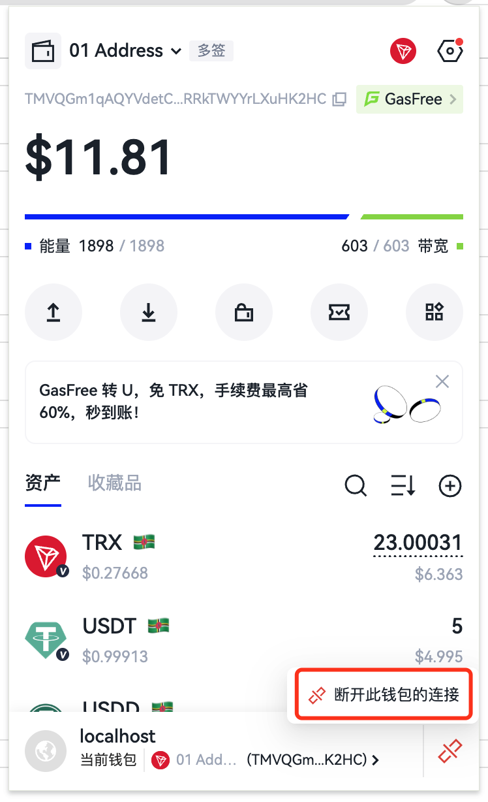
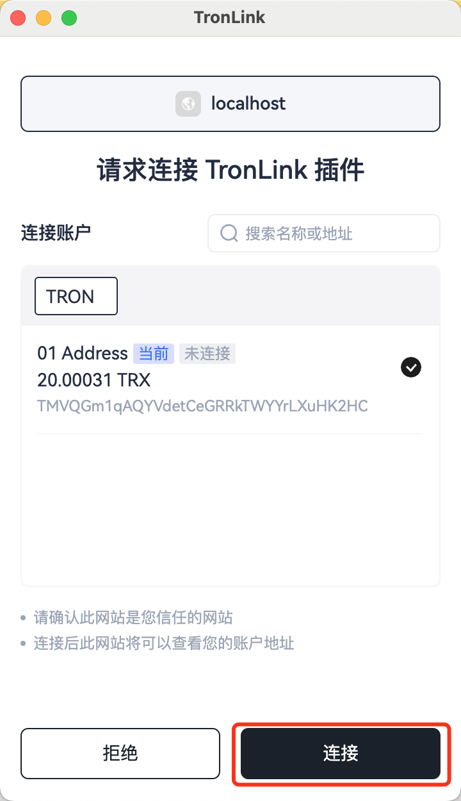
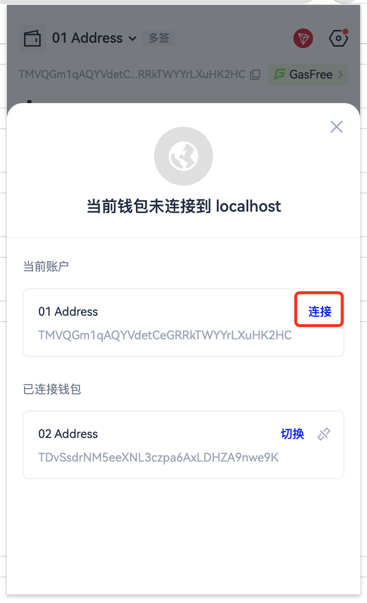

# 被动接收TronLink插件的消息

消息使用window.postMessage发送，dapp接收到的内容是一个MessageEvent，可以参考[MessageEvent的MDN文档](https://developer.mozilla.org/en-US/docs/Web/API/MessageEvent)

### 账户改变消息

消息标识： `accountsChanged`
#### 简介
以下情况会产生此消息

  1. 用户登陆

  2. 用户切换账号

  3. 用户锁定钱包

  4. 钱包超时自动锁定

#### 技术规范
##### 代码示例
```typescript
window.tron.on('accountsChanged', (accountArray) => {
  // handler logic
  console.log('got accountsChanged event', accountArray)
})
```
##### 返回值
```typescript
['your_current_account_address']
```
###### 返回值示例
1. 用户登陆时，消息体内容为
```json
['TZ5XixnRyraxJJy996Q1sip85PHWuj4793'] // 当前的账号
```

2. 用户切换账号时，消息体内容为
```json
['TRKb2nAnCBfwxnLxgoKJro6VbyA6QmsuXq'] // 新选择的账号地址
```

3. 用户锁定和钱包超时自动锁定时，消息体内容为
```json
[]
```


### 网络改变消息

消息标识： `chainChanged`
#### 简介
开发者可以监听此消息来获取网络的改变
以下情况会产生此消息

1. 用户改变网络的时候
#### 技术规范
##### 代码示例
```typescript
window.tron.on('chainChanged', ({chainId}) => {
  // handler logic
  console.log('got chainChanged event', chainId)
})
```

##### 返回值

```json
{
  chainId: string;
}
```
- 目前只支持如下chainId：
  - mainnet(主网): `0x2b6653dc`
  - shasta(shasta测试网): `0x94a9059e`
  - nile(nile测试网): `0xcd8690dc`
- chainId的值大小写敏感。

### TronLink可以提供服务的消息

消息标识： `connect`
#### 简介
如果TronLink及`window.tron`对象可用，那么必定发出此事件。
这包括以下情况：

 - provider在初始化完成后，连接到一个链。

 - `disconnect`事件发出后，provider连接到一个链。

#### 技术规范
##### 代码示例
```typescript
window.tron.on('connect', ({chainId}) => {
  // handler logic
  console.log('got connect event', chainId)
})
```

### 断开连接网站消息
消息标识： `disconnect`
#### 简介
如果provider与所有链断开连接，则provider必须发出`disconnect`事件，并返回`ProviderRpcError`对象的错误。
#### 技术规范
##### 代码示例
```typescript
tron.on('disconnect', (providerRpcError: ProviderRpcError) => {
  console.error(connectInfo); // { code: 4900, message: 'Disconnected' }
})
```

### 历史遗留问题
以下四个消息为了兼容3.x保留，并在未来版本将会被废弃

1. 用户拒绝连接消息`rejectWeb`

2. 用户断连网站消息`disconnectWeb`

3. 用户确定连接消息`acceptWeb`

4. 用户主动连接网站消息`connectWeb`

#### 用户拒绝连接消息
消息标识： `rejectWeb`

以下情况会产生此消息

1. dapp请求连接，用户在弹窗中拒绝连接后
 



开发者可以监听此消息来获取用户拒绝连接消息
```typescript
window.addEventListener('message', function (e) {
  if (e.data.message && e.data.message.action == "rejectWeb") {
      // handler logic
      console.log('got rejectWeb event', e.data)
  }
})
```

#### 用户断连网站消息
消息标识： `disconnectWeb`

以下情况会产生此消息

1. 用户主动断接网站




开发者可以监听此消息来获取用户主动断连消息
```typescript
window.addEventListener('message', function (e) {
  if (e.data.message && e.data.message.action == "disconnectWeb") {
      // handler logic
      console.log('got disconnectWeb event', e.data)
  }
})
```

#### 用户确定连接消息
消息标识： `acceptWeb`

以下情况会产生此消息

1. 用户确定连接消息




开发者可以监听此消息来获取用户确定连接消息
```typescript
window.addEventListener('message', function (e) {
  if (e.data.message && e.data.message.action == "acceptWeb") {
      // handler logic
      console.log('got acceptWeb event', e.data)
  }
})
```

#### 用户主动连接网站消息
消息标识： `connectWeb`

以下情况会产生此消息

1. 用户确定连接消息





开发者可以监听此消息来获取用户主动连接网站消息
```typescript
window.addEventListener('message', function (e) {
  if (e.data.message && e.data.message.action == "connectWeb") {
      // handler logic
      console.log('got connectWeb event', e.data)
  }
})
```